# 🔒 Security Policy

## Supported Versions

| Version | Supported |
|---------|-----------|
| Latest (`main` branch) | ✅ Yes |

## Reporting a Vulnerability

**Do not** open a public GitHub issue for security vulnerabilities.

| Channel | Link |
|---------|------|
| Email | **security@dubsopenhub.com** |
| GitHub Private Reporting | [Open a security advisory](https://github.com/DUBSOpenHub/ai-first-toil-tracker/security/advisories/new) |

### What to Include

- Description of the vulnerability
- Steps to reproduce
- Potential impact
- Suggested fix (if you have one)

### Response SLA

| Step | Timeline |
|------|----------|
| Acknowledgment | 48 hours |
| Assessment | 1 week |
| Fix or mitigation | As soon as possible |
| Credit in release notes | Unless you prefer anonymity |

---

## Threat Model

```mermaid
flowchart TB
    subgraph Attack Surface
        A1["Issue form input\n(user-controlled text)"]
        A2["GitHub Actions workflows\n(shell execution)"]
        A3["Dashboard\n(client-side JS)"]
        A4["AI API calls\n(data in transit)"]
    end

    subgraph Controls
        C1["All ${'${{ }}'} in env: blocks\n— prevents script injection"]
        C2["Actions pinned to SHA\n— prevents supply-chain attacks"]
        C3["CSP meta tag\n— restricts resource loading"]
        C4["No secrets in code\n— GitHub Secrets only"]
        C5["Least-privilege permissions\n— per-workflow scoping"]
        C6["No data retention\n— AI processes in real-time"]
    end

    A1 --> C1
    A2 --> C2
    A2 --> C5
    A3 --> C3
    A4 --> C6
    A1 & A2 & A3 --> C4
```



### Supply-Chain Security

All GitHub Actions are **pinned to full SHA hashes**, not tags. This prevents a compromised upstream action from injecting malicious code.

```yaml
# ✅ Pinned to SHA
- uses: actions/checkout@11bd71901bbe5b1630ceea73d27597364c9af683 # v4.2.2

# ❌ Never use unpinned tags
- uses: actions/checkout@v4
```

Keep pinned SHAs current by accepting Dependabot PRs or manually bumping when new versions are released.

### Injection Prevention

All `${{ }}` expressions are assigned to **environment variables** rather than interpolated directly in `run:` blocks. This prevents shell injection via crafted issue titles or bodies.

```yaml
# ✅ Safe — expression goes into env
env:
  ISSUE_NUM: ${{ github.event.issue.number }}
run: echo "$ISSUE_NUM"

# ❌ Unsafe — expression interpolated in shell
run: echo "${{ github.event.issue.number }}"
```

### Workflow Permissions

Every workflow declares **explicit, minimal permissions**. No workflow requests more access than it needs.

| Workflow | Permissions |
|----------|------------|
| `ai-triage.yml` | `issues: write`, `models: read` |
| `dashboard-data.yml` | `contents: write`, `issues: read` |
| `win-celebration.yml` | `issues: write` |
| `monthly-roi-summary.yml` | `issues: write` |
| `stale.yml` | `issues: write`, `pull-requests: write` |

---

## Secret Management

| Rule | Details |
|------|---------|
| **Store secrets properly** | Use **Settings → Secrets and variables → Actions**. Never commit tokens to code, docs, or JSON files. |
| **Scope to workflows** | Only the workflows that need a secret should reference it. |
| **Rotate on team changes** | When someone leaves or a channel is archived, rotate affected tokens immediately. |
| **Audit regularly** | Review workflow logs for unexpected secret usage. Delete secrets no longer needed. |
| **No secrets in issues** | Never paste tokens, webhook URLs, or credentials into issue bodies or templates. |

---

## AI Data Handling

The AI triage workflow (`ai-triage.yml`) sends issue body text to the **GitHub Models API** (`openai/gpt-4o-mini`) to generate automation suggestions.

### What Is Sent

- The full issue body text (user's description of the toil)
- Parsed scoring context (frequency, time, people)

### What Is NOT Sent

- Repository secrets or tokens
- Other issues or comments
- User profile data beyond what's in the issue body

### Data Retention

- The AI model processes text **in real-time** and does not retain submitted data beyond the API request
- The AI's response is posted as an issue comment — no external storage

### Recommendations

- **Do not include** customer names, credentials, internal system identifiers, or classified information in toil descriptions
- Keep descriptions focused on the *type* of repetitive work, not the specific data involved
- Organizations with data classification requirements should review this workflow against their AI usage policies
- To disable AI-powered triage entirely, delete `.github/workflows/ai-triage.yml`

---

## Dashboard Security

The dashboard (`docs/dashboard/index.html`) is a static, single-file site served via GitHub Pages.

| Control | Implementation |
|---------|---------------|
| **Content Security Policy** | `<meta>` CSP tag restricts scripts, styles, fonts, and API connections to trusted origins |
| **No external JS** | All JavaScript is inline — no third-party scripts loaded |
| **External resources** | Google Fonts (Inter) only — loaded via CSP-allowed `fonts.googleapis.com` |
| **Data source** | `dashboard-data.json` (same-origin) or GitHub API (`api.github.com`) |
| **Local storage** | Inline score edits and team renames persisted in browser `localStorage` — never transmitted |
| **Links** | All external links use `rel="noopener noreferrer"` |

---

## Accessibility

- `prefers-reduced-motion` media query disables all animations
- Focus-visible outlines on all interactive elements
- Semantic HTML structure
- Print-friendly styling for leadership presentations
