# Architecture — AI-First Toil Tracker

## Overview

The Toil Tracker is a zero-dependency, GitHub-native system. There is no server, no database, and no build step. GitHub Issues are the data store, GitHub Actions are the compute layer, and GitHub Pages is the presentation layer.

## System Architecture

## Data Flow — Toil Lifecycle

## Scoring Pipeline

```mermaid
flowchart LR
    FORM["Issue Form"] --> PARSE["Parse Fields"]
    PARSE --> FREQ["Frequency\n1 · 2 · 3 · 5 · 8"]
    PARSE --> TIME["Time\n1 · 2 · 3 · 5 · 8"]
    PARSE --> PPL["People\n1 · 2 · 3 · 5 · 8"]
    FREQ & TIME & PPL --> CALC["Score =\nF × T × P"]
    CALC --> PRI{"Priority"}
    PRI -- "≥ 40" --> CRIT["🔴 Critical"]
    PRI -- "≥ 20" --> HIGH["🟡 High"]
    PRI -- "≥ 10" --> MED["🟢 Medium"]
    PRI -- "< 10" --> LOW["⚪ Low"]
    CALC --> EST["Monthly mins =\nmult × mins × people"]
    CALC --> AI["GitHub Models API\nSuggest automation"]
```

## Dashboard Data Pipeline

```mermaid
flowchart LR
    subgraph Trigger["Triggers"]
        SCHED["⏰ Daily cron"]
        EVENT["📋 Issue opened/edited/closed"]
        MANUAL["🖱️ Manual dispatch"]
    end

    subgraph Generate["dashboard-data.yml"]
        FETCH["Fetch all toil + win issues"]
        SCORE["Re-score each item"]
        AGG["Aggregate by team,\ncategory, priority"]
        BUILD["Build JSON"]
    end

    subgraph Serve["GitHub Pages"]
        JSONF["dashboard-data.json"]
        HTMLF["index.html"]
    end

    SCHED & EVENT & MANUAL --> FETCH
    FETCH --> SCORE --> AGG --> BUILD
    BUILD -- "git commit" --> JSONF
    JSONF -- "fetch()" --> HTMLF
```

## File Map

## Workflow Detail

| Workflow | Trigger | Inputs | Outputs | Permissions |
|----------|---------|--------|---------|-------------|
| `ai-triage.yml` | Issue opened (label: `toil`) or manual | Issue number | Labels, triage comment | `issues: write`, `models: read` |
| `dashboard-data.yml` | Daily cron, issue events, manual | — | `dashboard-data.json` | `contents: write`, `issues: read` |
| `win-celebration.yml` | Issue labeled `automated` | — | Comment on original toil issue | `issues: write` |
| `monthly-roi-summary.yml` | 1st of month or manual | — | New summary issue | `issues: write` |
| `stale.yml` | Daily schedule | — | Comments + closes stale issues | `issues: write` |

## Security Model

```mermaid
flowchart TB
    subgraph Hardening["Security Controls"]
        PIN["All Actions pinned to SHA"]
        ENV["All expressions in env: blocks\n(no injection in run:)"]
        CSP["CSP meta tag on dashboard"]
        PERM["Top-level permissions: {}"]
        SEC["No secrets in code"]
    end

    subgraph Secrets["GitHub Secrets"]
        GH["GITHUB_TOKEN\n(auto-provided)"]
    end

    subgraph Data["Data Boundaries"]
        IN["Issue body text → AI model"]
        OUT["AI suggestion → issue comment"]
        NONE["No data stored beyond\nGitHub Issues + JSON"]
    end

    PIN & ENV & CSP & PERM & SEC --> SAFE["Hardened Pipeline"]
    GH --> SAFE
    SAFE --> IN --> OUT
```

## Technology Stack

| Layer | Technology | Notes |
|-------|-----------|-------|
| Data store | GitHub Issues | Labels, comments, and form fields |
| Compute | GitHub Actions | Ubuntu runners, bash + `gh` CLI + `jq` |
| AI | GitHub Models API | `openai/gpt-4o-mini`, 400 token limit |
| Presentation | GitHub Pages | Static HTML from `/docs` folder |
| Dashboard | Vanilla HTML/CSS/JS | Single file, no build, no dependencies |
| Fonts | Google Fonts (Inter) | Only external resource |
